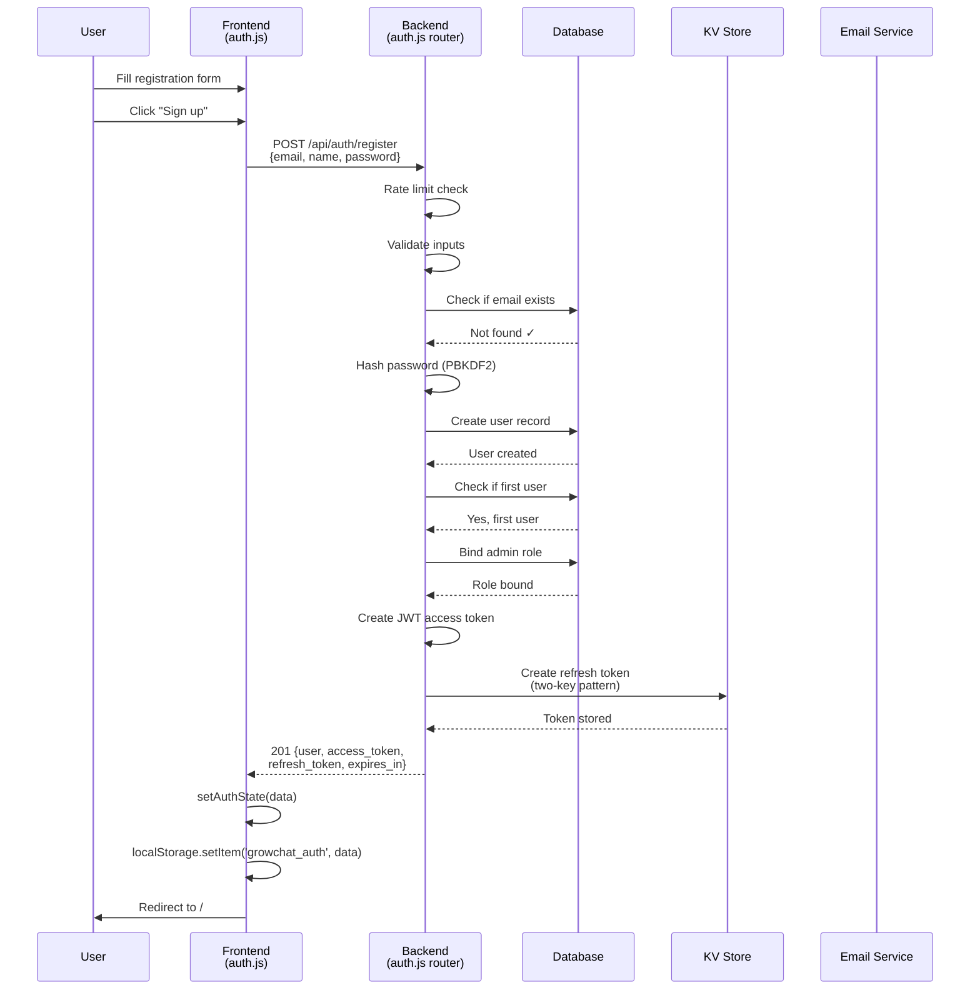
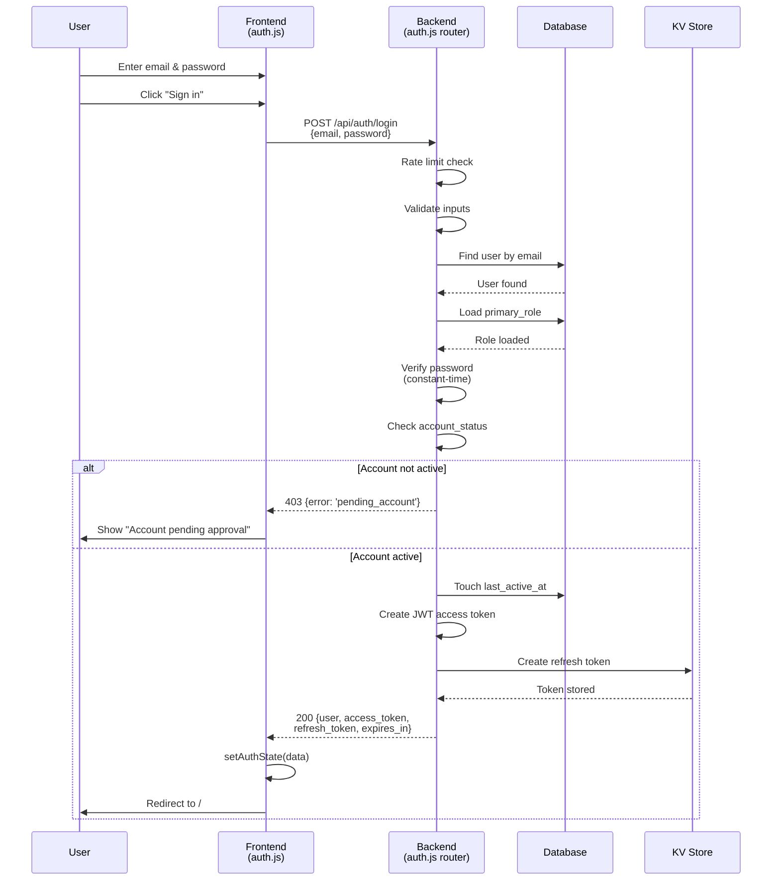
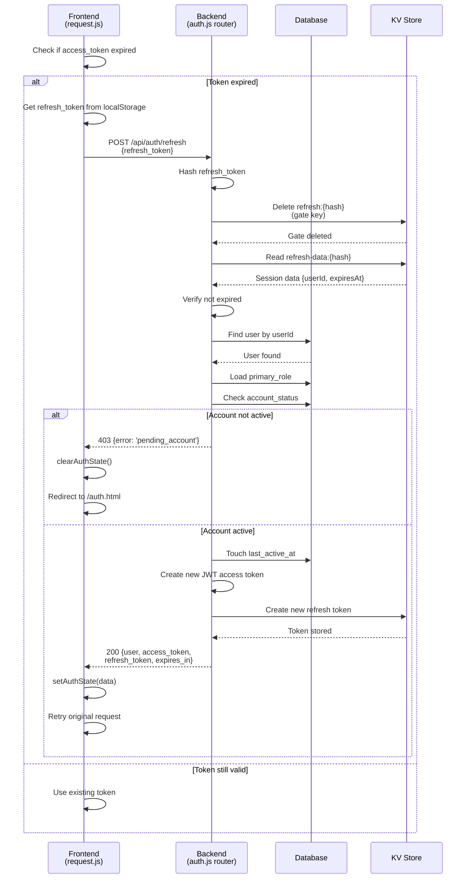
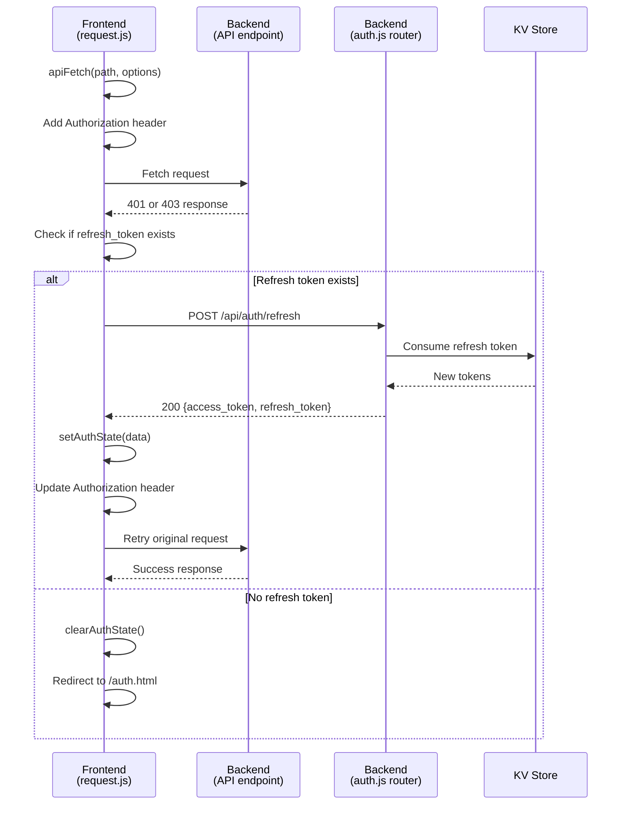
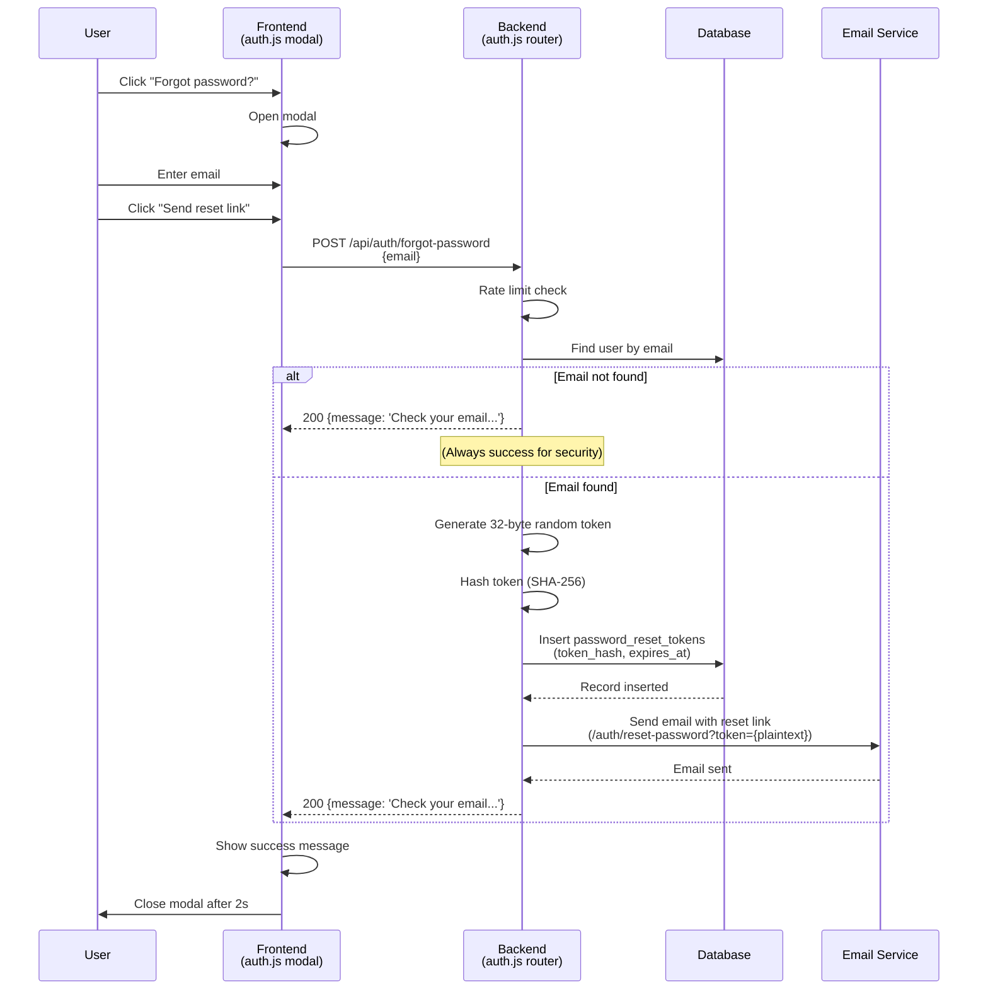
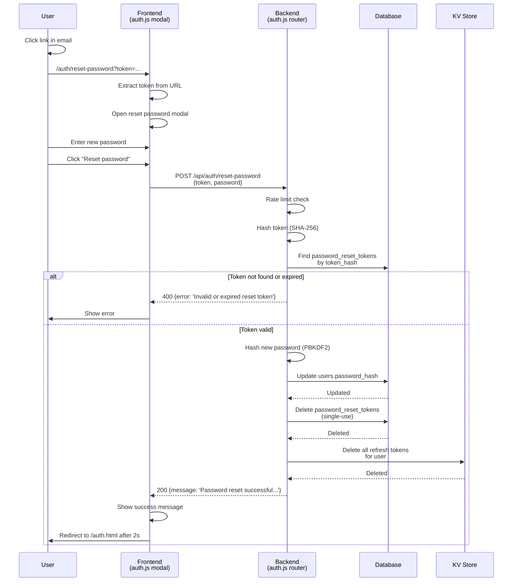
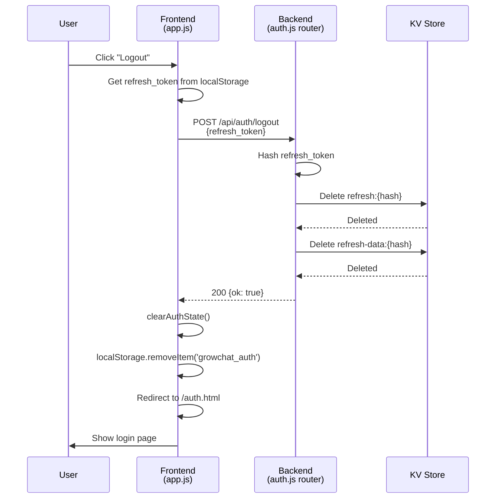
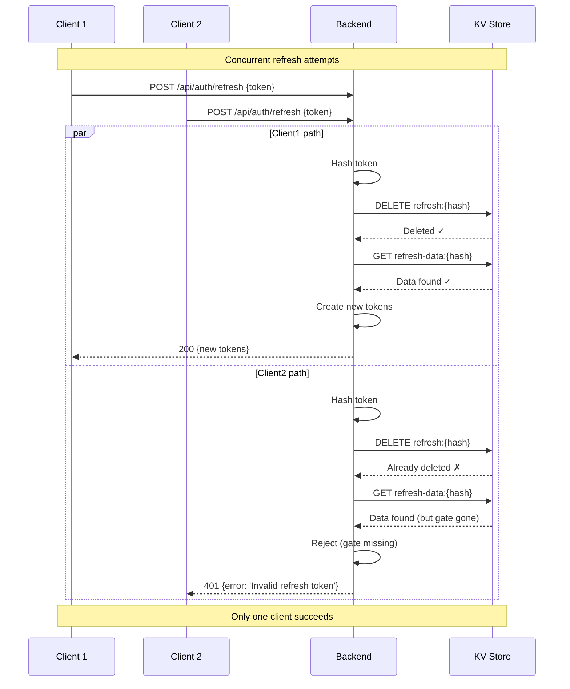
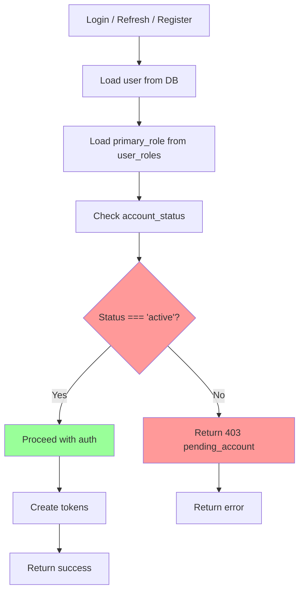
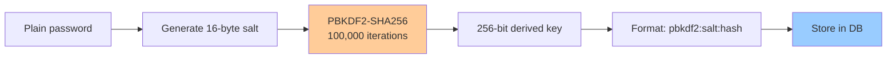

# GrowChat Authentication - Sequence Diagrams

## 1. Registration Flow



---

## 2. Login Flow



---

## 3. Token Refresh Flow



---

## 4. Automatic Token Refresh on 401/403



---

## 5. Password Reset - Request Phase



---

## 6. Password Reset - Completion Phase



---

## 7. Logout Flow



---

## 8. Two-Key Refresh Token Pattern (Race Prevention)



---

## 9. Account Status Check on Every Auth Event



---

## 10. Password Hashing: PBKDF2 Process



---

## 11. JWT Structure

```
Header.Payload.Signature

Header:
{
  "alg": "HS256",
  "typ": "JWT"
}

Payload:
{
  "sub": "user-id",
  "email": "user@example.com",
  "primary_role": "admin",
  "name": "User Name",
  "iat": 1234567890,
  "exp": 1234568790
}

Signature:
HMAC-SHA256(
  base64url(header) + "." + base64url(payload),
  JWT_SECRET
)
```

---

## 12. KV Storage Keys

```
Refresh Token Storage (SESSIONS namespace):

refresh:{hash}
├─ Value: '1' (gate key)
├─ TTL: 7 days
└─ Purpose: Prevent concurrent reuse

refresh-data:{hash}
├─ Value: { userId, expiresAt }
├─ TTL: 7 days
└─ Purpose: Session data (read-only after gate deleted)

Client Session ID (sessionStorage):

growchat_client_session_id
├─ Value: '{timestamp}-{uuid}'
├─ Scope: Per tab
└─ Purpose: Track client sessions
```
