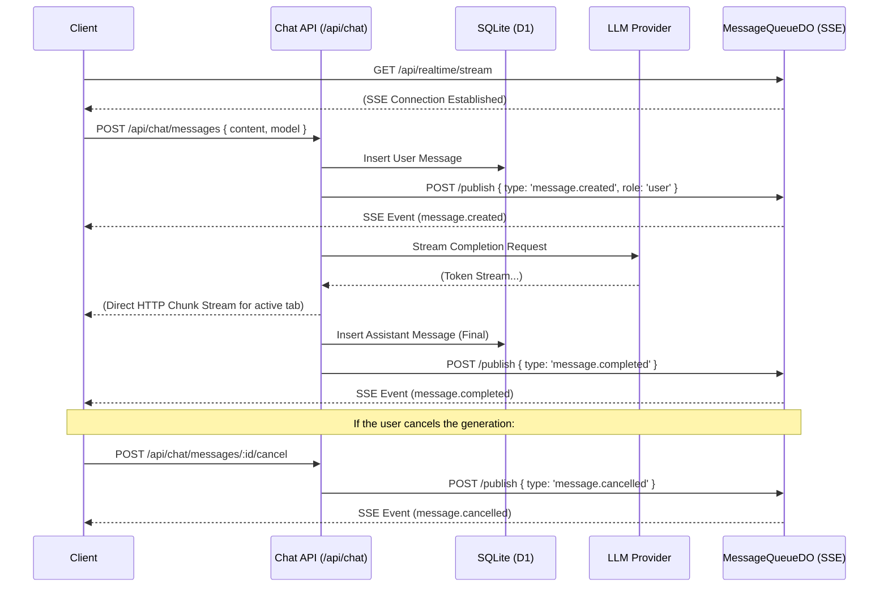

# Chat Streaming & Realtime Flow

This graph documents the flow of a message from the client through the database, to the LLM, and back to all connected client tabs via SSE.

```mermaid
sequenceDiagram
    participant Client
    participant API as Chat API (/api/chat)
    participant DB as SQLite (D1)
    participant LLM as LLM Provider
    participant DO as MessageQueueDO (SSE)

    Client->>DO: GET /api/realtime/stream
    DO-->>Client: (SSE Connection Established)

    Client->>API: POST /api/chat/messages { content, model }
    API->>DB: Insert User Message
    API->>DO: POST /publish { type: 'message.created', role: 'user' }
    DO-->>Client: SSE Event (message.created)
    
    API->>LLM: Stream Completion Request
    LLM-->>API: (Token Stream...)
    API-->>Client: (Direct HTTP Chunk Stream for active tab)

    API->>DB: Insert Assistant Message (Final)
    API->>DO: POST /publish { type: 'message.completed' }
    DO-->>Client: SSE Event (message.completed)

    Note over Client,DO: If the user cancels the generation:
    Client->>API: POST /api/chat/messages/:id/cancel
    API->>DO: POST /publish { type: 'message.cancelled' }
    DO-->>Client: SSE Event (message.cancelled)
```
