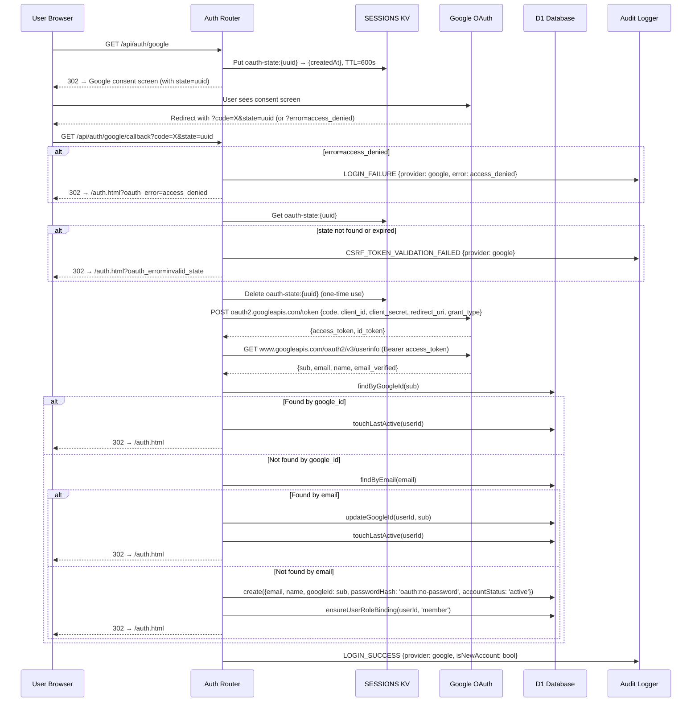

# Google OAuth 2.0 Flow

This document maps the complete Google OAuth 2.0 authentication flow for GrowChat.

## Overview

Google OAuth allows users to sign in using their Google account. The flow follows the standard OAuth 2.0 authorization code grant, adapted for Cloudflare Workers (no external libraries, all token exchange via `fetch()`).

## Prerequisites

- `GOOGLE_CLIENT_ID` and `GOOGLE_CLIENT_SECRET` must be configured as wrangler secrets.
- Google OAuth 2.0 credentials must be set up in the Google Cloud Console with redirect URI: `{APP_URL}/api/auth/google/callback`.

## Flow Diagram



## Account Resolution

| Step | Lookup                | Condition                   | Action                              |
| ---- | --------------------- | --------------------------- | ----------------------------------- |
| 1    | `findByGoogleId(sub)` | User already linked         | Direct login (no changes)           |
| 2    | `findByEmail(email)`  | Email matches existing user | Link: `updateGoogleId(userId, sub)` |
| 3    | Neither found         | New user                    | Auto-provision with `member` role   |

## Token Delivery

Tokens are delivered via URL hash fragment, NOT query parameters:

```text
/auth.html#access_token=jwt-token&refresh_token=opaque-token&expires_in=900
```

Hash fragments are NOT sent to the server, which means:

- Tokens don't appear in server access logs
- Tokens don't leak via Referer headers
- Frontend JavaScript extracts and clears the hash immediately via `history.replaceState`

## Security Measures

| Measure         | Implementation                                                               |
| --------------- | ---------------------------------------------------------------------------- |
| CSRF Protection | `state` parameter (UUID, stored in KV, 10-min TTL, one-time use)             |
| Token Exchange  | Server-to-server only (Workers `fetch()`), no client-side token exposure     |
| Rate Limiting   | `auth-google` (redirect) and `auth-google-callback` (callback) per IP        |
| Audit Logging   | LOGIN_SUCCESS, LOGIN_FAILURE, CSRF_TOKEN_VALIDATION_FAILED events            |
| Account Status  | Pending accounts blocked from receiving tokens                               |
| Secrets         | GOOGLE_CLIENT_ID and GOOGLE_CLIENT_SECRET are wrangler secrets, never logged |

## Frontend Detection

The auth page detects Google OAuth availability via the health endpoint:

```text
GET /api/health → { ..., google_oauth: true/false }
```

- `google_oauth: true` → Show "Sign in with Google" button
- `google_oauth: false` → Button hidden entirely (no fallback UI)

## Related Files

- **Backend**: `src/routers/auth.js` (routes + helpers)
- **Repository**: `src/repositories/user-repository.js` (findByGoogleId, updateGoogleId)
- **Migration**: `migrations/007_google_oauth.sql`
- **Frontend**: `public/auth.html`, `public/js/bootstrap/auth.js`
- **Health**: `src/routers/public.js` (google_oauth flag)
- **Registry**: `src/bootstrap/router-registry.js` (PUBLIC_ROUTES)
- **Tests**: `src/routers/auth-google-oauth.test.js`
