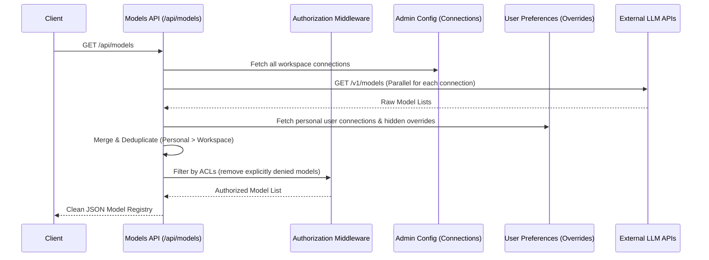

<<<<<<< HEAD
# LLM & Models Flow

This diagram illustrates how models are discovered, merged with user-overrides, authorized, and presented to the client.

=======
# LLM & Models Flow

This diagram illustrates how models are discovered, merged with user-overrides, authorized, and presented to the client.

>>>>>>> feature/short-term-tasks
