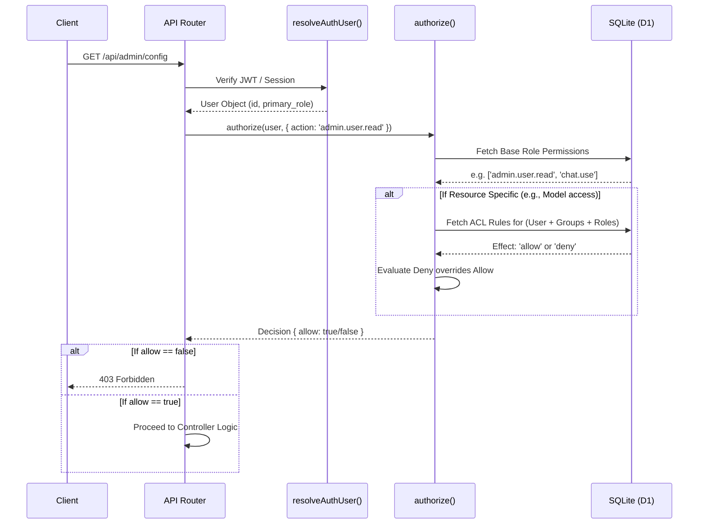

# RBAC Authorization Flow

This graph documents how an incoming API request is authorized against the user's role and granular ACL policies.

```mermaid
sequenceDiagram
    participant Client
    participant Router as API Router
    participant Auth as resolveAuthUser()
    participant RBAC as authorize()
    participant DB as SQLite (D1)

    Client->>Router: GET /api/admin/config
    Router->>Auth: Verify JWT / Session
    Auth-->>Router: User Object (id, primary_role)
    
    Router->>RBAC: authorize(user, { action: 'admin.user.read' })
    
    RBAC->>DB: Fetch Base Role Permissions
    DB-->>RBAC: e.g. ['admin.user.read', 'chat.use']
    
    alt If Resource Specific (e.g., Model access)
        RBAC->>DB: Fetch ACL Rules for (User + Groups + Roles)
        DB-->>RBAC: Effect: 'allow' or 'deny'
        RBAC->>RBAC: Evaluate Deny overrides Allow
    end
    
    RBAC-->>Router: Decision { allow: true/false }
    
    alt If allow == false
        Router-->>Client: 403 Forbidden
    else If allow == true
        Router->>Router: Proceed to Controller Logic
    end
```
