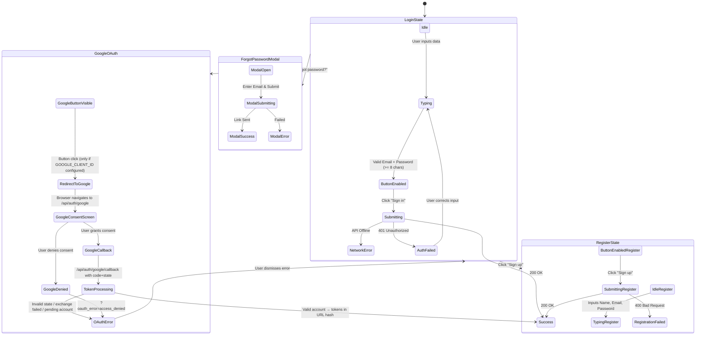

# Authentication User Flow (`/auth.html`)

This document maps the user flows, states, and edge cases for the authentication interface.

## Flow Diagram

## State & Interaction Details

### 1. Default Login View (Empty State)

- **Trigger**: User navigates to `/auth.html`.
- **UI State**:
  - Title: "Sign in to GrowChat".
  - Inputs visible: `Email`, `Password`.
  - Submit Button: "Sign in" - **Client-side disabled by default**.
- **Edge Case / Bug Discovery Check**:
  - _Expected_: Button is disabled to prevent empty submissions.
  - _Actual_: Confirmed via Playwright. The button is disabled until criteria are met.

### 2. Client-Side Validation State

- **Trigger**: User begins typing in input fields.
- **Rules**:
  - The submit button remains disabled until:
    - `Email` field passes native browser `type="email"` validation.
    - `Password` field meets `minlength="8"` requirement.
- **Edge Case**:
  - If a user types 7 characters in the password field, the button remains visually dimmed (`opacity-60`, `cursor-not-allowed`) and cannot be clicked.

### 3. Submission & API Error States

- **Trigger**: User provides valid inputs and clicks "Sign in" / "Sign up".
- **Backend Flow**: Triggers [`POST /api/auth/login`](../../backend/apis/auth.md) or [`POST /api/auth/register`](../../backend/apis/auth.md).
- **UI State during submission**:
  - Button text changes to "Signing in..." or "Signing up...".
  - Button becomes temporarily disabled to prevent double-submission.
- **Failure Edge Cases**:
  - **401 Invalid Credentials**: An inline red error text appears (`#auth-error`). The button resets to enabled.
  - **400 Email Exists (Registration)**: Shows inline red error.
  - **Network Timeout / Offline**: Shows "Network error. Please try again."
  - **Pending Approval (Registration)**: If account requires admin approval, error text turns _green_ and displays "Your account is pending approval."

### 4. Forgot Password Modal

- **Trigger**: Clicking "Forgot password?".
- **Backend Flow**: Triggers [`POST /api/auth/forgot-password`](../../backend/apis/auth.md).
- **UI State**:
  - A fixed overlay (`bg-black bg-opacity-50`) appears, trapping focus.
  - Presents an email input and a "Send reset link" button.
- **Interaction**:
  - Clicking outside the modal container or clicking "Cancel" closes the modal and clears the input.
  - Success state replaces the modal form with a green success message before auto-closing after 2 seconds.

---

### 5. Google OAuth Sign-In

- **Trigger**: User clicks "Sign in with Google" button.
- **Prerequisites**: `GOOGLE_CLIENT_ID` must be configured (detected via `/api/health` response `google_oauth: true`).
- **Backend Flow**: Triggers [`GET /api/auth/google`](../../backend/apis/auth.md) → Google consent → [`GET /api/auth/google/callback`](../../backend/apis/auth.md).
- **UI State**:
  - The "Sign in with Google" button is displayed above the email/password form, separated by an "or" divider.
  - Clicking the button triggers a top-level browser navigation to `/api/auth/google` (no AJAX — this is a full redirect).
  - On return from Google callback, tokens are extracted from the URL hash fragment and processed via `handleOAuthCallback()`.
  - The hash fragment is immediately cleared via `history.replaceState` for security.
- **Error States** (OAuth callback errors shown in `#auth-error`):
  - **Access Denied**: User cancelled the Google consent. "Sign in with Google was cancelled."
  - **Invalid State**: CSRF state check failed. "Security check failed. Please try again."
  - **Rate Limited**: Too many OAuth attempts. "Too many attempts. Please wait and try again."
  - **Exchange Failed**: Google token exchange error. "Could not connect to Google. Please try again."
  - **Missing Info**: Google profile missing email. "Google account is missing required information."
  - **Pending Account**: Account exists but not activated. "Your account is pending admin approval."
- **Edge Cases**:
  - If `GOOGLE_CLIENT_ID` is not configured, the Google button is hidden entirely (no fallback).
  - If user returns with hash tokens AND query error, hash tokens take priority (checked first in code).
  - Google-only users (with `password_hash: 'oauth:no-password'`) cannot log in via email/password.
