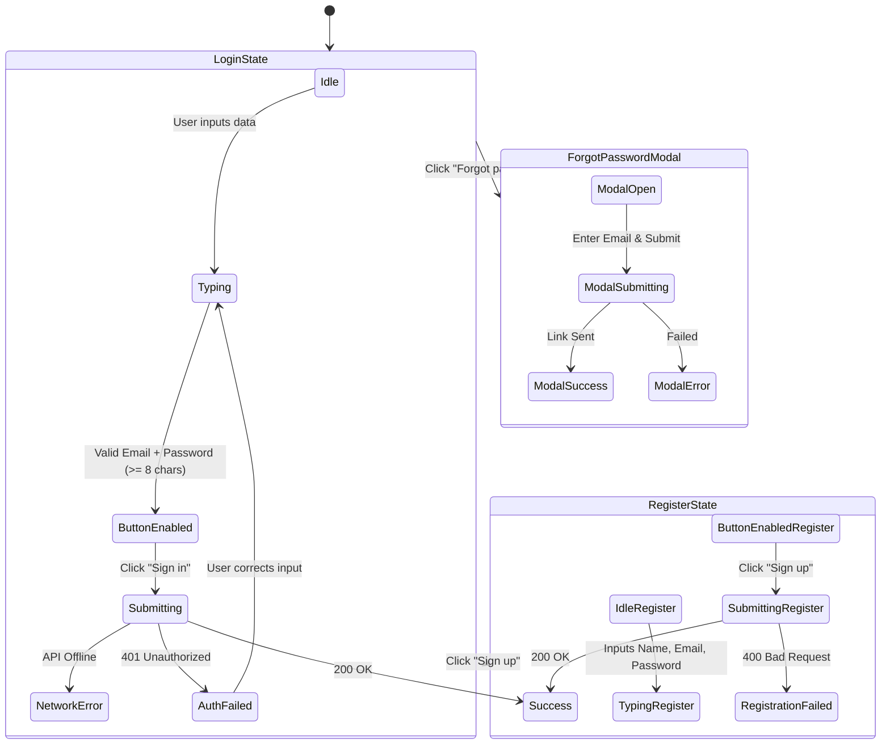

# Authentication User Flow (`/auth.html`)

This document maps the user flows, states, and edge cases for the authentication interface.

## Flow Diagram

## State & Interaction Details

### 1. Default Login View (Empty State)
- **Trigger**: User navigates to `/auth.html`.
- **UI State**:
  - Title: "Sign in to GrowChat".
  - Inputs visible: `Email`, `Password`.
  - Submit Button: "Sign in" - **Client-side disabled by default**.
- **Edge Case / Bug Discovery Check**: 
  - *Expected*: Button is disabled to prevent empty submissions.
  - *Actual*: Confirmed via Playwright. The button is disabled until criteria are met.

### 2. Client-Side Validation State
- **Trigger**: User begins typing in input fields.
- **Rules**:
  - The submit button remains disabled until:
    - `Email` field passes native browser `type="email"` validation.
    - `Password` field meets `minlength="8"` requirement.
- **Edge Case**: 
  - If a user types 7 characters in the password field, the button remains visually dimmed (`opacity-60`, `cursor-not-allowed`) and cannot be clicked.

### 3. Submission & API Error States
- **Trigger**: User provides valid inputs and clicks "Sign in" / "Sign up".
- **UI State during submission**:
  - Button text changes to "Signing in…" or "Signing up…".
  - Button becomes temporarily disabled to prevent double-submission.
- **Failure Edge Cases**:
  - **401 Invalid Credentials**: An inline red error text appears (`#auth-error`). The button resets to enabled.
  - **400 Email Exists (Registration)**: Shows inline red error.
  - **Network Timeout / Offline**: Shows "Network error. Please try again."
  - **Pending Approval (Registration)**: If account requires admin approval, error text turns *green* and displays "Your account is pending approval."

### 4. Forgot Password Modal
- **Trigger**: Clicking "Forgot password?".
- **UI State**:
  - A fixed overlay (`bg-black bg-opacity-50`) appears, trapping focus.
  - Presents an email input and a "Send reset link" button.
- **Interaction**:
  - Clicking outside the modal container or clicking "Cancel" closes the modal and clears the input.
  - Success state replaces the modal form with a green success message before auto-closing after 2 seconds.

---

## Design System Deviations (Needs Fixing)

Based on the newly established `DESIGN.md` guidelines, the current Authentication page has significant visual bugs:

1. **Brand Accent Color Violation**: The current submit button uses `bg-[#171717]` (Near-Black). The design guidelines strictly mandate `Action Blue (#0066cc)` for all primary "click me" signals.
2. **Border Radius Scale Violation**: The inputs and buttons currently use `rounded-[20px]`. The design guidelines dictate `{rounded.pill}` (9999px) for primary actions and inputs to match the "Apple pill" aesthetic.
3. **Typography**: The page title currently uses standard generic font weight handling rather than the specific `-0.374px` letter-spacing tracking required for `{typography.display-lg}`.
