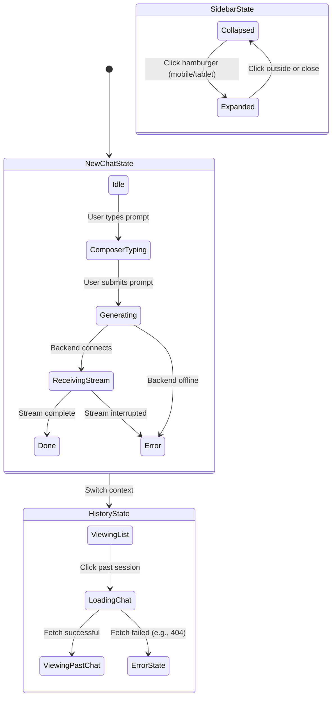

# Main Chat Interface (`/`) User Flow

This document maps the user flows, states, and edge cases for the primary chat interface.

## Flow Diagram

## State & Interaction Details

### 1. The Empty "New Chat" State
- **Trigger**: User creates a new chat or logs in without an active session ID in the URL.
- **UI State**:
  - Center hero text: "How can I help you today?".
  - Suggestion chips: 4 pre-defined prompt cards.
  - Composer: Fixed at the bottom, pill-shaped input.
- **Edge Case / Bug Discovery Check**: 
  - *If model list fails to load*: Does the composer disable itself? Or does it fail silently when the user clicks send?
  - *If a suggestion chip is clicked*: Does it immediately submit, or just fill the composer? (Expected: Fills the composer and submits automatically).

### 2. Message Composer & Streaming Generation
- **Trigger**: User types a prompt and hits "Enter" or the submit button.
- **UI State**:
  - User message immediately appends to the chat log (optimistic UI update).
  - The empty state hero and suggestion chips disappear.
  - A loading indicator (e.g., pulsing dots or a spinner) appears while waiting for the first token.
  - The composer input should clear and potentially disable (or show a "Stop Generating" button).
- **Edge Cases**:
  - **Network Disconnect Mid-Stream**: The UI should gracefully halt and present a "Retry" button on the incomplete message.
  - **Very Long Inputs (10,000+ words)**: Does the textarea auto-grow infinitely, or does it cap at a `max-height` with internal scrolling? (Expected: cap at `max-height`).
  - **Rapid Double-Clicking Submit**: Does the UI prevent firing the same prompt twice before the first response arrives?

### 3. Chat History Sidebar Navigation
- **Trigger**: User clicks a chat from the history list in the left sidebar.
- **UI State**:
  - The URL updates (e.g., `/?chat_id=123`).
  - A loading state appears in the main view.
  - The chat log populates with historical messages.
- **Edge Cases**:
  - **Deleted Chat**: If the user clicks a URL for a chat they deleted on another device (404), does it redirect to the empty state with a toast notification, or just show a blank broken screen?
  - **Responsive Collapsing**: On screens `< 834px`, clicking a chat should auto-collapse the sidebar so the user can immediately read the content.

---

## Design System Deviations (Needs Fixing)

Based on the newly established `DESIGN.md` guidelines, the chat interface requires visual alignment:

1. **Composer Border Radius**: 
   - *Expected*: The composer input bar should be a perfect `{rounded.pill}`.
2. **Action Button Colors**: 
   - *Expected*: The "New Chat" button and send icon should use the exact `Action Blue (#0066cc)`.
3. **Empty State Elevation**: 
   - *Expected*: Suggestion cards should be completely flat with a 1px hairline border, using `{colors.canvas}` or `{colors.canvas-parchment}` for distinction, without heavy drop shadows.
