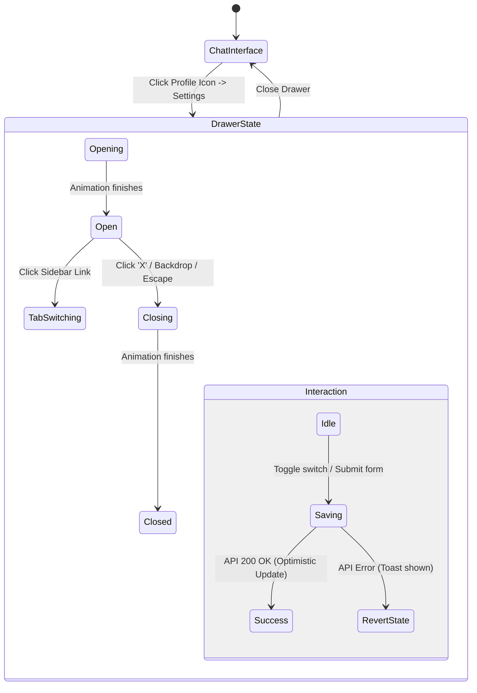

# Account Settings Drawer (`/account`) User Flow

This document maps the user flows, states, and edge cases for the personal "My Settings" drawer interface.

## Flow Diagram

## State & Interaction Details

### 1. Opening & Closing Mechanics

- **Trigger**: User clicks their profile icon in the bottom-left sidebar, then selects "Settings", OR navigates directly to `/account`.
- **UI State**:
  - The main application interface dims (backdrop-blur overlay).
  - A large "Drawer" or "Sheet" slides in, covering the majority of the screen but leaving context visible behind it.
  - The URL updates to `/account/settings/...` (routing is preserved).
- **Edge Cases / Bug Discovery**:
  - **Focus Trapping**: Pressing `Tab` repeatedly should loop focus _within_ the drawer and not escape to the obscured chat interface behind it.
  - **Browser Back Button**: Hitting "Back" in the browser should gracefully close the drawer and restore the underlying chat URL without triggering a full page reload.
  - **Escape Key**: Pressing `Esc` should close the drawer.

### 2. Navigation & Scope Badging

- **Trigger**: The drawer opens.
- **UI State**:
  - A prominent green `PERSONAL` badge sits next to "My Settings" in the header to explicitly define scope.
  - A left-aligned internal sidebar allows switching between "Connections", "Models", "Integrations", and "Security".
  - The Security tab renders a Change Password form (via `POST /api/auth/change-password`).
- **Edge Case Check**:
  - Does rapidly clicking between tabs before data is loaded cause race conditions or UI flickering?

### 3. Personal Connection Toggles

- **Trigger**: User clicks a toggle switch (e.g., enabling "cli-proxy-api" under Connections).
- **UI State**:
  - The switch slides and changes color.
- **Edge Cases**:
  - **Optimistic UI vs. Server Failure**: If the switch is toggled ON, but the API request to save the setting fails (e.g., network error), does the toggle correctly _revert_ to OFF and show an error toast? (Bug hunting target).

---

## Design System Deviations (Needs Fixing)

Based on the newly established `DESIGN.md` guidelines, the "My Settings" drawer requires visual alignment:

1. **Elevation & Shadowing**:
   - _Current_: The drawer relies on generic drop shadows to float above the canvas.
   - _Expected_: The system allows _exactly one_ drop shadow (reserved for product renders). To create the "floating" effect, the drawer should rely purely on the dimmed backdrop overlay, or adopt the frosted-glass `backdrop-filter: blur(N)` technique specified for sticky bars, rather than CSS shadows.
2. **Action Colors**:
   - _Expected_: Any text links or primary actionable buttons within the drawer must use `Action Blue (#0066cc)`.
3. **Corner Radii**:
   - _Current_: The drawer and internal highlight blocks use generic rounding.
   - _Expected_: Structural cards within the drawer should use `{rounded.lg}` (18px), and small interactive elements should map to `{rounded.sm}` or `{rounded.pill}`.
