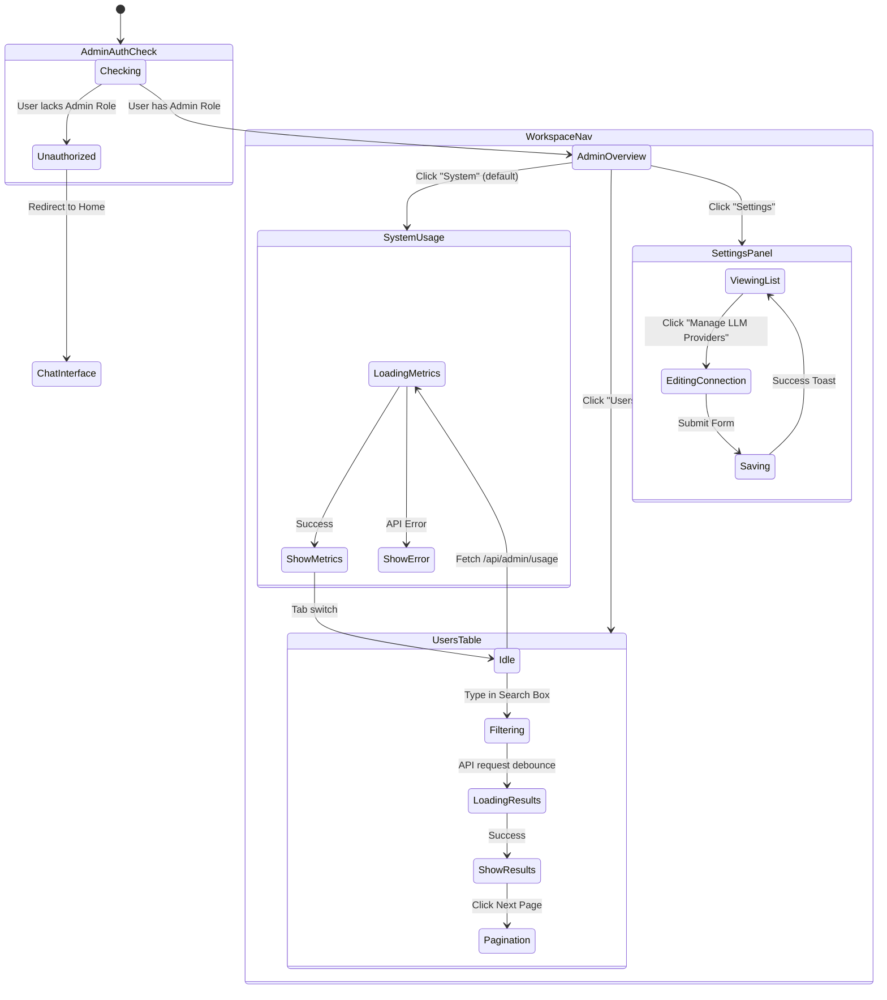

# Admin Workspace (`/admin`) User Flow

This document maps the user flows, states, and edge cases for the full-page administrative workspace.

## Flow Diagram

## State & Interaction Details

### 1. Scope Transition & Navigation

- **Trigger**: User navigates to `/admin`.
- **UI State**:
  - The interface fundamentally shifts from the chat "drawer/modal" paradigm to a dense, full-page data-management view.
  - The primary sidebar vanishes (or collapses), replaced by a new top-level horizontal navigation: "Users", "Settings", "System".
- **Edge Cases / Bug Discovery**:
  - **Role Downgrade Mid-Session**: If an admin's role is revoked by another admin while they are viewing this page, does the next API action return a 403, and does the UI gracefully kick them back to the home screen?

### 2. Usage Dashboard (System Sub-tab)

- **Trigger**: Viewing `/admin/system/usage` (default admin landing page).
- **UI State**:
  - Displays five key metric cards: Total Users, Active Users (7d), Active Users (30d), Messages (7d), Sparks (30d).
  - Each card includes a trend indicator (↑↓→) comparing current period vs previous period.
  - Below the cards: two data tables for daily (last 7 days) and weekly (last 4 weeks) message breakdowns.
  - Sparks detail section shows total, last 30d, and previous 30d LLM API call counts.
- **Data Source**: `GET /api/admin/usage` — all data from existing `users` and `messages` tables.
- **Edge Cases**:
  - **No Activity**: If there are zero messages in the period, trend indicator shows → (flat) with "no data".
  - **Fresh Workspace**: All counts show 0 or — with appropriate empty states.

### 3. Users Management Table

- **Trigger**: Viewing `/admin/users/overview`.
- **UI State**:
  - Displays a clean data grid.
  - Uses pill-shaped badges for Roles (`ADMIN` in blue, `MEMBER` in green) and Status (`ACTIVE`).
  - Search input at the top right.
  - Pagination controls at the bottom ("Show X per page", "Prev / Next").
- **Edge Cases**:
  - **Search Debouncing**: Rapidly typing in the search box should not fire 10 API requests. It must debounce.
  - **Pagination Overflow**: If a user is on Page 5, and performs a search that yields only 1 page of results, does the UI break, or gracefully reset to Page 1?
  - **Empty States**: If a search yields zero results, is there a clear "No users found" empty state, or just a broken blank table?

### 4. Workspace Settings (Connections)

- **Trigger**: Viewing `/admin/settings/connections`.
- **UI State**:
  - Empty State: Displays "No connections configured" when empty.
  - Action: An inline `+` button to add new providers.
- **Edge Cases**:
  - **Unsaved Changes**: If a user is half-way through filling out a new connection form and clicks a link to navigate away, does the UI warn them about unsaved changes?

---

## Design System Deviations (Needs Fixing)

Based on the newly established `DESIGN.md` guidelines, the Admin Workspace requires visual alignment:

1. **Top Navigation Colors**:
   - _Expected_: The global nav bar should be `{colors.surface-black}` (Pure Black) with white text, adhering to Apple's strict global nav pattern.
2. **Table Borders and Radii**:
   - _Expected_: If the table is contained within a utility card, it must use a 1px `{colors.hairline}` border and `{rounded.lg}` (18px) corners. No drop shadows.
3. **Pill Badges**:
   - _Current_: The `ADMIN` and `MEMBER` role badges use generic green/blue tints.
   - _Expected_: The UI should rely strictly on the defined color palette (e.g., if a badge needs to be blue, it should derive from the Action Blue family or rely purely on typography to denote status, minimizing the use of unapproved secondary colors).
4. **Search Input**:
   - _Current_: Uses standard generic rounding.
   - _Expected_: Must be a full pill `{rounded.pill}` to match the "search" grammar defined in the design system.
