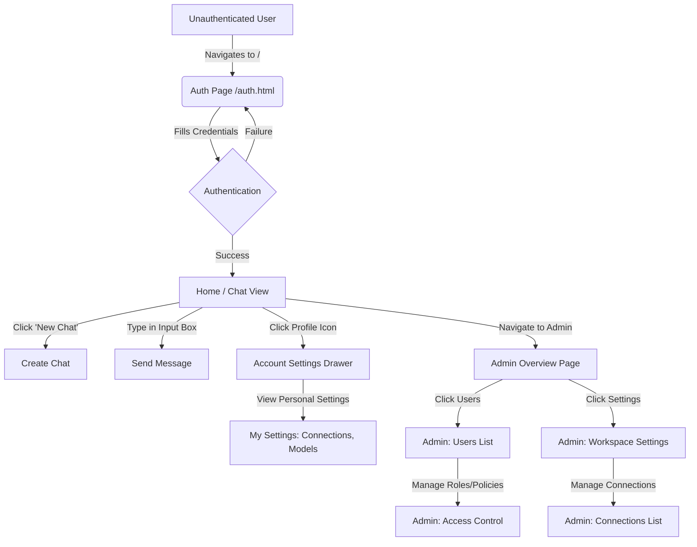

<<<<<<< HEAD
# GrowChat User Flow & UI/UX Interaction Mapping

This document provides a detailed overview of the UI/UX interaction behavior, relationships, and user flow mapping for the GrowChat application, based on the codebase analysis and Playwright-driven visual exploration.

## User Flow Diagram

## UI/UX Interaction Details

### 1. Home / Main Chat Interface (`/`)
The primary interface is designed around a split-pane layout focusing on the chat experience.
- **Left Sidebar:** Acts as the primary global navigation and chat history list. 
  - **Top:** Branding ("GrowChat"), a hamburger menu icon, "New Chat" button, and "Search".
  - **Middle:** A collapsible "CHATS" section listing recent conversations.
  - **Bottom:** The user's profile indicator (e.g., Avatar, Name, "Online" status).
- **Main Content Area:** When starting a new session, a welcoming center-aligned hero section appears ("How can I help you today?") accompanied by suggestion cards (e.g., "Summarize an article", "Suggest a recipe").
- **Input Bar:** Fixed at the bottom of the content area. Features a clean, rounded pill-like shape with attachment `+` and microphone icons.

### 2. Admin Workspace: Users Management (`/admin/users/overview`)
The admin interface transitions to a denser, more operational layout.
- **Top Navigation:** Introduces horizontal routing specific to the admin scope: "Users", "Settings", "System".
- **Secondary Sidebar:** A sub-navigation pane appears on the left (but to the right of the global sidebar if expanded) containing: "Overview", "Roles", "Groups", "Policies".
- **Main Content (Data Table):** Displays a structured table for user management. Features include:
  - Global search bar for filtering users.
  - Columns: ROLE (with distinct colored badges like `ADMIN`, `MEMBER`), NAME, STATUS (e.g., `ACTIVE` badge), and EMAIL.
  - Pagination controls at the bottom right.

### 3. Personal Settings / "My Settings" Drawer (`/account/settings/profile`)
Personal settings are distinctly separated from workspace admin settings to avoid confusing scope.
- **Presentation:** Rendered as a modal overlay/drawer over the main application, keeping the user contextually anchored to their primary task.
- **Header:** Explicitly labeled with a `PERSONAL` badge and "My Settings", with a close `x` icon.
- **Navigation:** A sidebar internal to the drawer offers: "Connections", "Models", "Integrations", "Security".
- **Content:** Displays personal configurations (e.g., personal LLM Providers) with toggle switches for quick state changes. The UI is lighter and uses personal language.

### 4. Admin Settings: Workspace Scope (`/admin/settings/connections`)
Contrasting with the "My Settings" drawer, the Admin Settings utilize a full-page layout to signify workspace-wide impact.
- **Top Navigation:** Active state shifts to "Settings".
- **Secondary Sidebar:** Contextually updates to show: "Connections", "Models", "Integrations".
- **Main Content:** The layout uses a similar structure to the Users page but focuses on workspace-level configurations (e.g., configuring LLM Chat Providers for the entire organization). 

## Design System Execution

The UI rigorously implements a clean, low-density aesthetic:
- **Typography:** Relies heavily on sans-serif readability with hierarchical weight distribution (e.g., confident semi-bold headers, muted text for secondary elements).
- **Component Shapes:** Utilizes soft rounded corners (`border-radius`) for cards, buttons, and input fields to make the interface feel approachable.
- **State Indicators:** Employs pill-shaped badges for states (`ACTIVE`, `ADMIN`, `PERSONAL`) to quickly convey information without visual clutter.
- **Elevation:** Keeps the interface mostly flat. Elevation is reserved primarily for the "My Settings" modal overlay to establish z-index priority.

## Interaction Paradigms
- **Scope Clarity:** The application uses structural differences to convey scope. "Drawers" equal personal/transient actions, while "Full-Page Views" equal workspace/permanent administrative actions.
- **Context Preservation:** Navigating to personal settings does not require a hard page load, preserving the underlying chat state behind a dimmed backdrop.
=======
# GrowChat User Flow & UI/UX Interaction Mapping

This document provides a detailed overview of the UI/UX interaction behavior, relationships, and user flow mapping for the GrowChat application, based on the codebase analysis and Playwright-driven visual exploration.

## User Flow Diagram

## UI/UX Interaction Details

### 1. Home / Main Chat Interface (`/`)
The primary interface is designed around a split-pane layout focusing on the chat experience.
- **Left Sidebar:** Acts as the primary global navigation and chat history list. 
  - **Top:** Branding ("GrowChat"), a hamburger menu icon, "New Chat" button, and "Search".
  - **Middle:** A collapsible "CHATS" section listing recent conversations.
  - **Bottom:** The user's profile indicator (e.g., Avatar, Name, "Online" status).
- **Main Content Area:** When starting a new session, a welcoming center-aligned hero section appears ("How can I help you today?") accompanied by suggestion cards (e.g., "Summarize an article", "Suggest a recipe").
- **Input Bar:** Fixed at the bottom of the content area. Features a clean, rounded pill-like shape with attachment `+` and microphone icons.

### 2. Admin Workspace: Users Management (`/admin/users/overview`)
The admin interface transitions to a denser, more operational layout.
- **Top Navigation:** Introduces horizontal routing specific to the admin scope: "Users", "Settings", "System".
- **Secondary Sidebar:** A sub-navigation pane appears on the left (but to the right of the global sidebar if expanded) containing: "Overview", "Roles", "Groups", "Policies".
- **Main Content (Data Table):** Displays a structured table for user management. Features include:
  - Global search bar for filtering users.
  - Columns: ROLE (with distinct colored badges like `ADMIN`, `MEMBER`), NAME, STATUS (e.g., `ACTIVE` badge), and EMAIL.
  - Pagination controls at the bottom right.

### 3. Personal Settings / "My Settings" Drawer (`/account/settings/profile`)
Personal settings are distinctly separated from workspace admin settings to avoid confusing scope.
- **Presentation:** Rendered as a modal overlay/drawer over the main application, keeping the user contextually anchored to their primary task.
- **Header:** Explicitly labeled with a `PERSONAL` badge and "My Settings", with a close `x` icon.
- **Navigation:** A sidebar internal to the drawer offers: "Connections", "Models", "Integrations", "Security".
- **Content:** Displays personal configurations (e.g., personal LLM Providers) with toggle switches for quick state changes. The UI is lighter and uses personal language.

### 4. Admin Settings: Workspace Scope (`/admin/settings/connections`)
Contrasting with the "My Settings" drawer, the Admin Settings utilize a full-page layout to signify workspace-wide impact.
- **Top Navigation:** Active state shifts to "Settings".
- **Secondary Sidebar:** Contextually updates to show: "Connections", "Models", "Integrations".
- **Main Content:** The layout uses a similar structure to the Users page but focuses on workspace-level configurations (e.g., configuring LLM Chat Providers for the entire organization). 

## Design System Execution

The UI rigorously implements a clean, low-density aesthetic:
- **Typography:** Relies heavily on sans-serif readability with hierarchical weight distribution (e.g., confident semi-bold headers, muted text for secondary elements).
- **Component Shapes:** Utilizes soft rounded corners (`border-radius`) for cards, buttons, and input fields to make the interface feel approachable.
- **State Indicators:** Employs pill-shaped badges for states (`ACTIVE`, `ADMIN`, `PERSONAL`) to quickly convey information without visual clutter.
- **Elevation:** Keeps the interface mostly flat. Elevation is reserved primarily for the "My Settings" modal overlay to establish z-index priority.

## Interaction Paradigms
- **Scope Clarity:** The application uses structural differences to convey scope. "Drawers" equal personal/transient actions, while "Full-Page Views" equal workspace/permanent administrative actions.
- **Context Preservation:** Navigating to personal settings does not require a hard page load, preserving the underlying chat state behind a dimmed backdrop.
>>>>>>> feature/short-term-tasks
